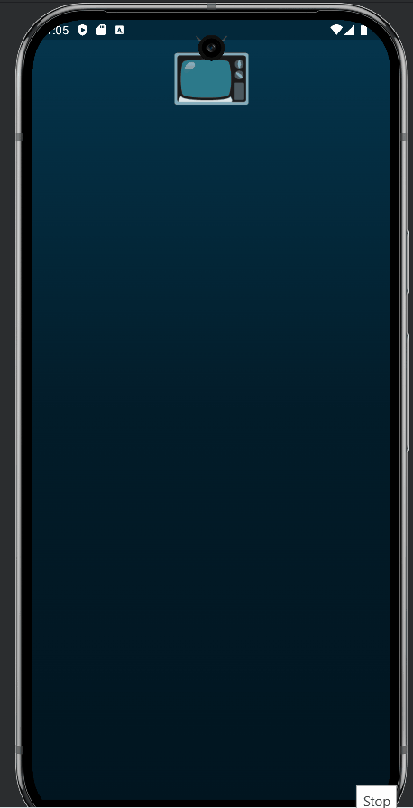
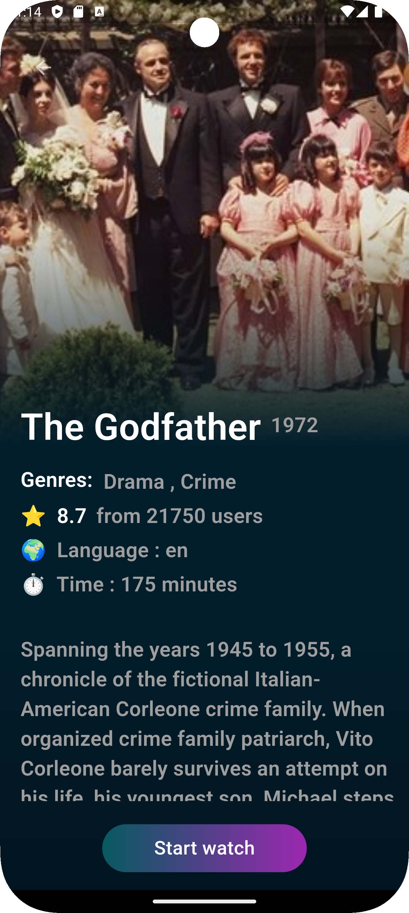
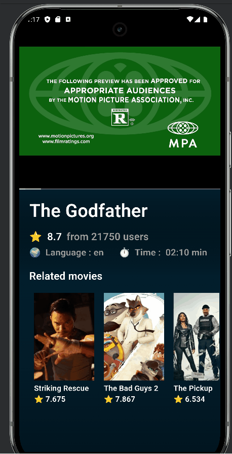

# 🎥 Movie App

A Flutter application that displays movies fetched from **TMDB API**, with a smooth and modern UI/UX.

---

## ✨ Features
- 🚀 **Splash Screen Animation**  
  TV emoji 📺 drops from the top with animation, then the app title fades in.
- 🎭 **Hero Animation**  
  Movie poster images smoothly transition from the list to the details screen.
- 🎞️ **Movie Categories**  
  Browse Popular, Top Rated, and Upcoming movies.
- 📄 **Movie Details Page**  
  Includes title, description, rating, and poster with animations.


---

## 📸 Screenshots
(Add screenshots/gifs of your app here)

---

## 🛠️ Tech Stack
- **Flutter**
- **Dart**
- **TMDB API**

---

## 🚀 Getting Started
1. Clone the repository
   ```bash
   git clone https://github.com/YourUsername/movie_app.git
   ```bash
   flutter pub get
   ```bash-
   flutter run

## 📸 Shots
| SplashScreen                                     | Home Screen                                    |
|--------------------------------------------------|------------------------------------------------|
|  |  |

| Movie Details                               | Trailer                                           |
|---------------------------------------------|---------------------------------------------------|
|  |  |
